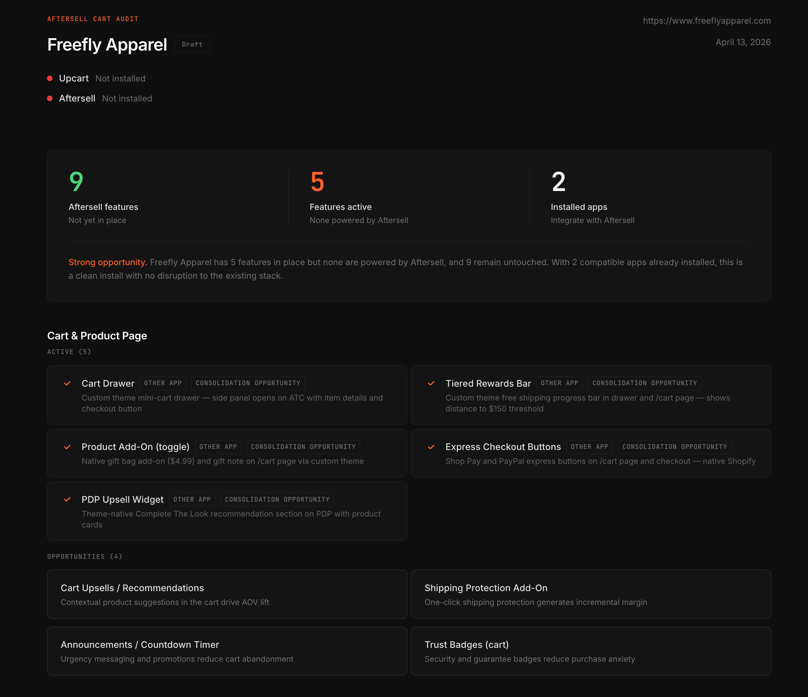

# Aftersell Claude Skills

I created this skill as part of my interview process for an Agency Partner Manager role with Aftersell. It didn't work out unfortunately, but I didn't want this work to go to waste. My vision for this was to create a tool that could quickly and accurately identify what Aftersell features a brand was not taking advantage of by simply providing Claude with their URL. This is definitely a rough first version, especially given the heavy reliance on browser use. The thought experiment was how much value could we create by trading some amount of quality (i.e. product SME manually find opportunities) in exchange for the scale provided by running multiple audits in paralell. 



---

## Skills

### 🔍 [`cart-audit`](./cart-audit/)
**Audits a Shopify merchant's cart and checkout flow for Aftersell feature gaps.**

Crawls a live store with browser-use, evaluates 14 Aftersell/UpCart features (cart drawer, checkout extensions, post-purchase upsell, Rokt Thanks, etc.), detects competing apps, and generates a self-contained HTML scorecard. Built for walking into agency conversations with proof — not guesses — about what's missing.

```
/cart-audit freeflyapparel.com
```

---

## Install

```bash
git clone https://github.com/NickLaws0n/aftersell-cart-audit.git
cp -r aftersell-cart-audit/cart-audit ~/.claude/skills/
```

Skills are picked up automatically by Claude Code on next session start.

### Requirements

- [Claude Code](https://claude.ai/code)
- [browser-use](https://github.com/browser-use/browser-use) installed
- `python3` (standard on macOS/Linux)

No API keys or credentials required.

---

## Why This Skill

Showing up to an agency conversation with a live audit of their client's store is more effective than a generic pitch. This skill came out of wanting a repeatable, verifiable way to identify what's missing — so conversations start from proof, not assumptions.

The scorecard template, feature checklist, and detection patterns are all works in progress and designed to be improved iteratively.
